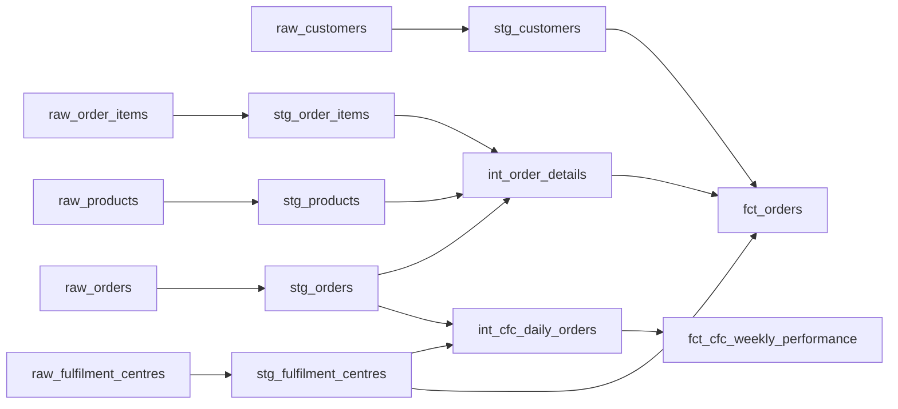

# grocery_ops_demo — dbt Demo Project

A demo dbt project built on Snowflake, modelling online grocery order fulfilment operations.
Covers the full pipeline from raw seed data through staged, intermediate, and mart layers.

## dbt concepts covered

- Seeds (CSV sources loaded with `dbt seed`)
- Staging / intermediate / mart layers
- `ref()` Jinja calls throughout all layers
- Custom macros: `pence_to_pounds`, `safe_divide`, `generate_schema_name`
- Generic tests: `not_null`, `unique`, `accepted_values`, `relationships`
- Singular test: `assert_delivered_orders_have_actual_date`
- External packages: `dbt_utils` (surrogate key) and `dbt_expectations` (column range assertions)
- Incremental model: `fct_orders` using `is_incremental()` + `updated_at` watermark
- Full YAML documentation on every model and every column

## Setup

```bash
# 1. Install the Snowflake adapter
pip install dbt-snowflake

# 2. Configure your connection
cp profiles.yml ~/.dbt/profiles.yml
# Edit ~/.dbt/profiles.yml with your Snowflake credentials

# 3. Install packages
dbt deps

# 4. Load seed data
dbt seed

# 5. Build everything (runs + tests)
dbt build

# 6. Preview results
dbt show --select fct_orders --limit 10
dbt show --select fct_cfc_weekly_performance --limit 10

# 7. Generate docs
dbt docs generate && dbt docs serve
```

## Project structure

```
models/
  staging/      — one view per seed; light type casting and renaming only
  intermediate/ — joins and business logic; ephemeral (not materialised in warehouse)
  marts/        — analysis-ready tables for dashboards and reporting
macros/         — pence_to_pounds, safe_divide, generate_schema_name
tests/          — singular SQL assertion
seeds/          — raw CSV data for customers, products, orders, items, and fulfilment centres
terraform/      — dbt platform project and environment provisioning
```

## Data model

**Seeds (raw layer)**
| Table | Description |
|-------|-------------|
| `raw_customers` | 30 customer accounts with loyalty tier and acquisition channel |
| `raw_products` | 25 SKUs across 7 categories with cost and price in pence |
| `raw_orders` | 40 orders spanning placement → picking → dispatch → delivery |
| `raw_order_items` | 94 line items linking orders to products |
| `raw_fulfilment_centres` | 6 automated fulfilment centres with capacity and robot fleet data |

**Key business questions answered**
- Weekly gross margin by region and loyalty tier (`fct_orders`)
- On-time delivery rate and throughput utilisation per fulfilment centre (`fct_cfc_weekly_performance`)

## Lineage



## Terraform (dbt platform)

Provisions a dbt platform project with development and production environments plus a daily build job.

```bash
cd terraform
terraform init
terraform plan -var="dbt_account_id=<your_account_id>" -var="dbt_service_token=<your_token>"
terraform apply
```

Sensitive variables should be passed via environment variables or a `terraform.tfvars` file
(already gitignored). Never commit credentials.
